# Tutorial on Responsive Design

In this tutorial, I am going to show you how to develop a page using a *mobile-first, responsive design*. By *mobile-first*, I mean that we will design for people viewing our page on mobile phones first. Then, we will adjust the styles so that the page takes advantage of tablets or computers with larger screens. By *responsive* design, I mean that a single page of HTMl and CSS will change its styles depending on the size of the screen you are using to view the page.

## HTML Boilerplate

To start with, let's use this HTML boilerplate, which you can put into a file called `index.html`:

```html
<!DOCTYPE html>
<html lang='en'>
  <head>
    <meta charset='UTF-8'/>
    <meta name='viewport'
      content='width=device-width, initial-scale=1.0, maximum-scale=1.0' />
    <title>Daniel's Place</title>
    <link rel='stylesheet' href='styles.css'/>
  </head>
  <body>
  </body>
</html>
```

Notice that we have a title and a link to a style sheet, `styles.css`. An important line is:

```html
<meta name='viewport'
      content='width=device-width, initial-scale=1.0, maximum-scale=1.0' />
```

This instructs the browser to avoid zooming out to show a desktop version when you are on a mobile device. If you find that your page is showing the desktop version of your site on a mobile device, this generally means you have forgotten this line.

I also like to add the following styles to `styles.css`:

```css
body {
    margin: 0;
    padding: 0;
    box-sizing: border-box;
}

```

## Site Layout

You should conceptually plan out your pages before writing any code. In a larger company, this might be done for you by a web designer. But often on smaller projects or personal hobby sites you may be the only one on the project -- you are the web designer! So let's do a basic design.

I'm going to dream a bit and imagine I'm runnnig a restaurant.:

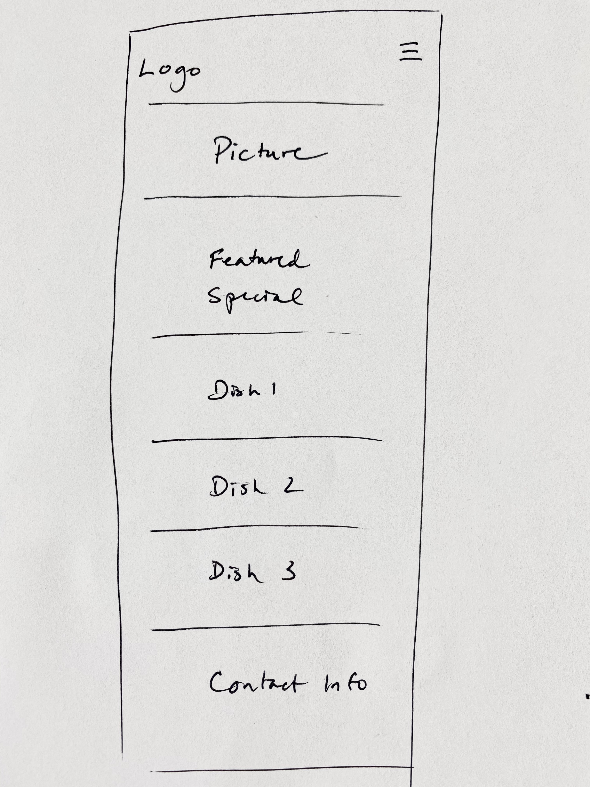

The top part will have a logo and a `hamburger` icon for the mobile menu, then a beautiful picture to showcase my restaurant, a feature special such as a 2-for-1 deal, some pictures of the amazing dishes we serve, and then contact information at the bottom.

## Basic design

For the logo and the menu, I'm going to use a [pure CSS, responsive menu](https://codepen.io/mutedblues/pen/MmPNPG). I just copied the HTML and adjusted the menu names, and then put all the CSS into `styles.css`.

```html
<body>
    <header class="header">
        <a href="" class="logo">Daniel's Place</a>
        <input class="menu-btn" type="checkbox" id="menu-btn" />
        <label class="menu-icon" for="menu-btn"><span class="navicon"></span></label>
        <ul class="menu">
            <li><a href="#menu">Menu</a></li>
            <li><a href="#order">Order</a></li>
            <li><a href="#contact">Contact</a></li>
        </ul>
    </header>
</body>
```

Start a local Python web server:

```sh
python3 -m http.server
```

and then open Chrome at `localhost:8000`. Right click and choose `Inspect` to open Chrome's developer tools and click the responsive design icon, shown below in blue:

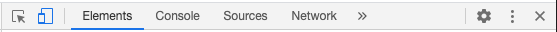

You should be able to see:

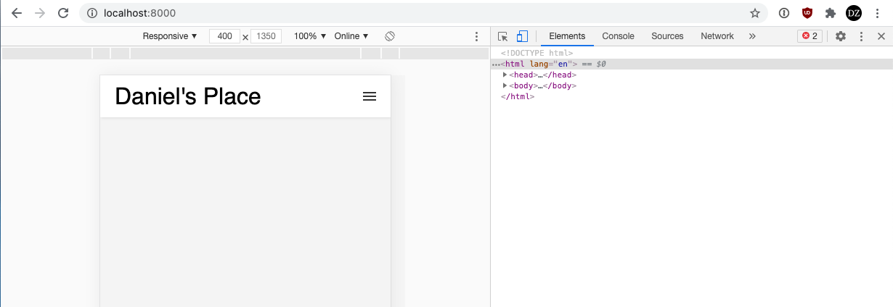

If you click the menu:

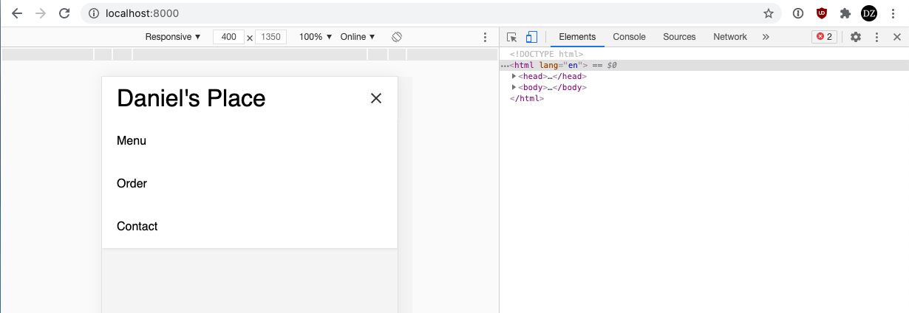

We will leave an explanation of the complex CSS that makes this work until later. See the end of this tutorial.

I do recommend removing the background color until you decide on a color scheme for your site:

```css
body {
    background-color: #fff;
}
```

## Cover photo

Let's add a nice cover photo. I like to use the [Creative Commons image search](https://search.creativecommons.org). You should pay attention to the attribution requirements of the photos you use.

Let's pick a photo a place it in a `div`:

```html
<div class="photo">
    
</div>
```

We should also add a style to make sure the image covers the whole page:

```css
img {
    width: 100%;
    display: block;
}
```

Changing the display property to `block` ensures no extra space is added below the image.

Here is what we have so far:

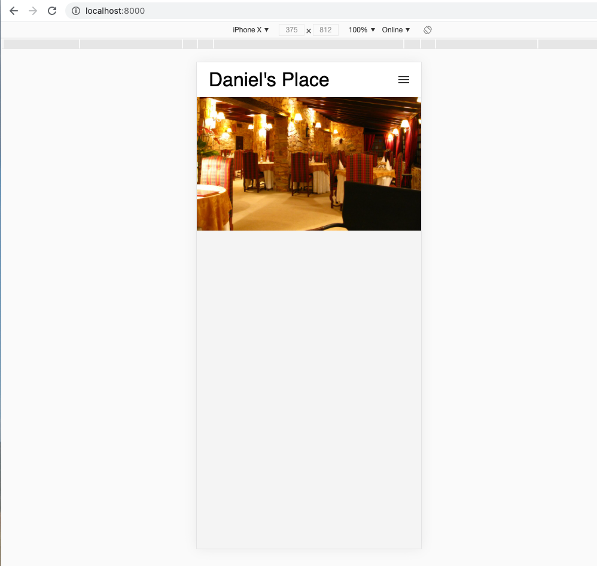

## Special

Let's add a grand opening special:

```html
<div class="special">
    <h2>Grand Opening</h2>
    <h3>Buy 1 entree get 1 entree free</h3>
    <p>Good until 13 February 2021</p>
</div>
```

With no styling, we can at least see that we are on the right track:

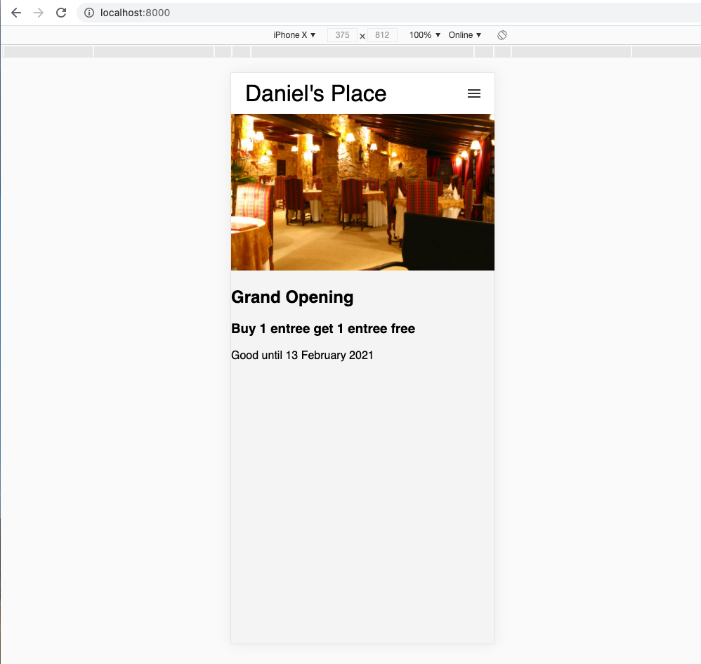

Let's add a little style to it to ensure we have good spacing and help it stand out better:

```css
.special {
  text-align: center;
  background-color: #000;
  color: #fff;
  padding: 20px;
  margin: 0px;
}

.special h3 {
  margin: 50px 0px;
}
```

This looks quite a bit nicer:

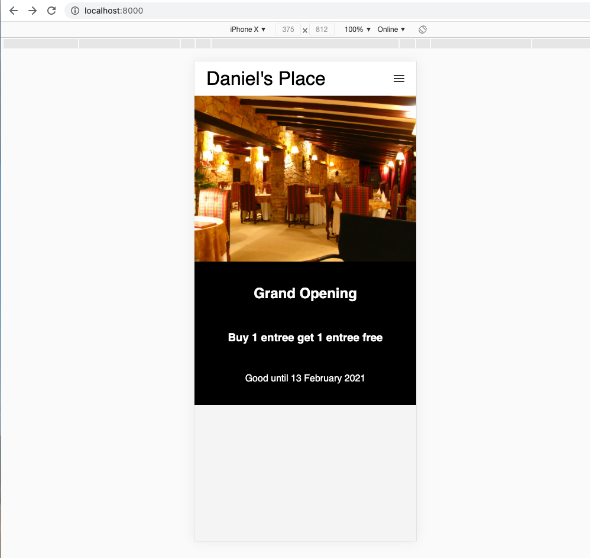

## Dishes

Let's add some photos of nice dishes we serve at our restaurant:

```html
<div class="dishes">
    <div class="dish">
        
    </div>
    <div class="dish">
        
    </div>
    <div class="dish">
        
    </div>
</div>
```

Now we have some pictures of dishes on the site:

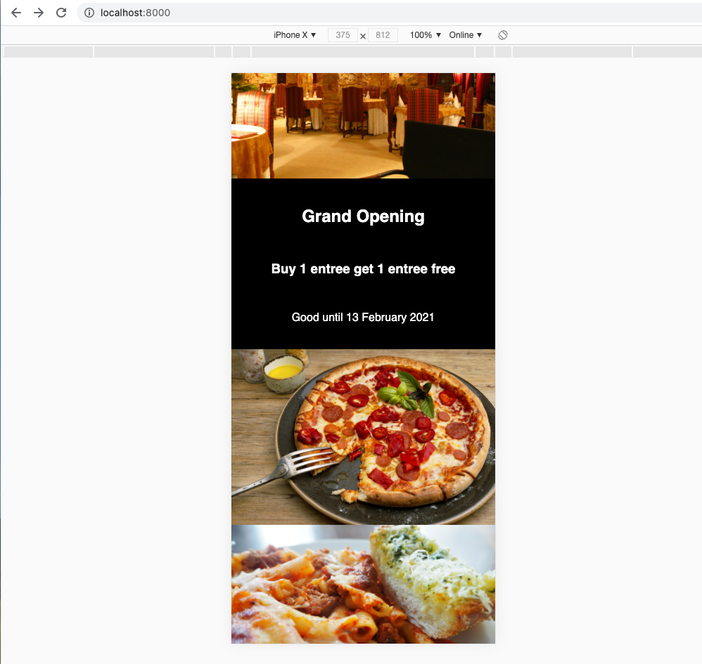

I downloaded images for these dishes from [Unsplash](https://unsplash.com), which also offers a lot of freely-reusable images.

## Contact Information

Finally, let's add some information about how to contact us in a footer at the bottom.

```html
<div class="contact">
    <h2>Contact Us</h2>
    <p>You can find us at 900 Astor Street, in downtown Astoria.</p>
    
</div>
```

```css
.contact {
    text-align: center;
}
```

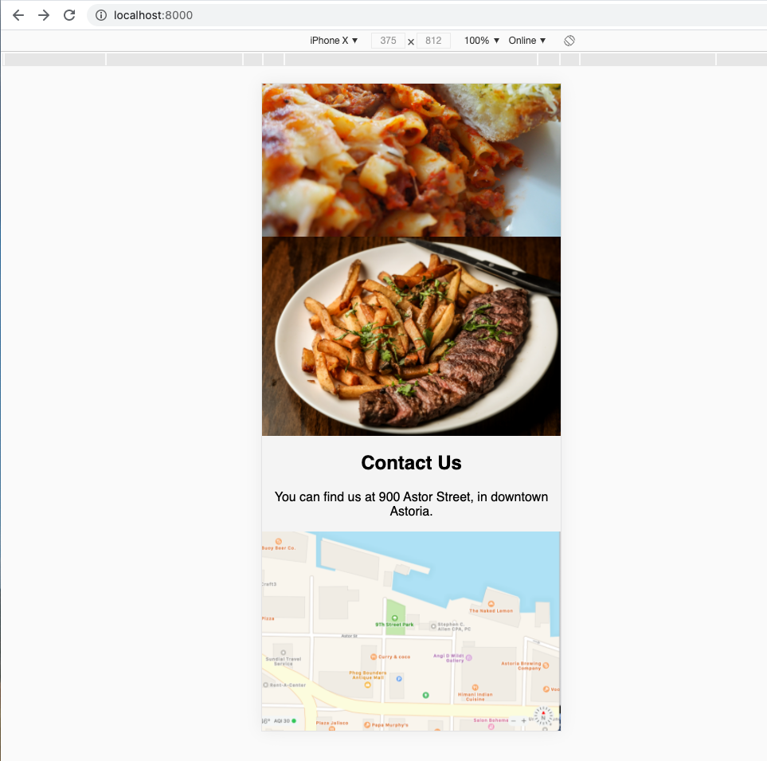

## Sizing for larger screens

How does this look if we use a larger screen (turn off the responsive design in the development tools)? The site works just fine, it's just sized to fill the entire browser:

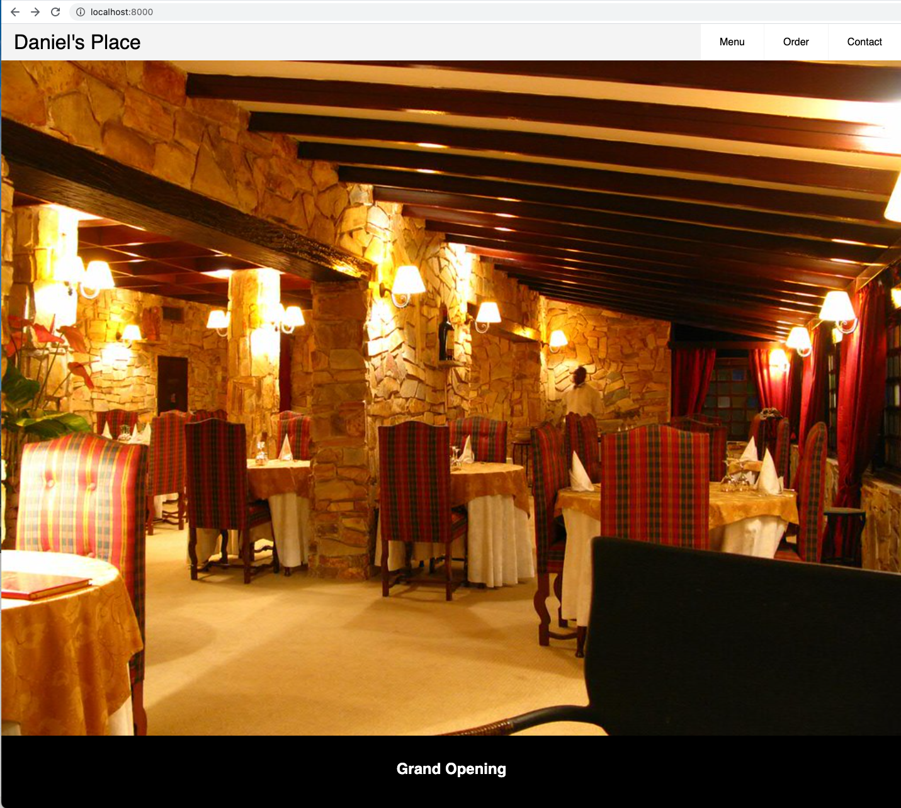

The responsive menu example we copied works well, but otherwise the site is just not sized properly.

This is where media queries can help us to introduce styles that will work better on larger screens. 

Let's start by looking at the media query used for our responsive menu:

```css
@media (min-width: 48em) {
    .header li {
        float: left;
    }

    .header li a {
        padding: 20px 30px;
    }

    .header .menu {
        clear: none;
        float: right;
        max-height: none;
    }

    .header .menu-icon {
        display: none;
    }
}
```

This set of rules takes effect when the minimum width of the screen is 48em, which is [a unit relative to the font size of the page](https://developer.mozilla.org/en-US/docs/Learn/CSS/Building_blocks/Values_and_units). You can use pixel sizes for breakpoints if you prefer, see for example [this advice](https://css-tricks.com/em-based-media-queries-are-based-on/).

Once the size of the screen hits this breakpoint, then the entire menu is floated to the right, while individual items in the menu are floated left within the menu box and have some padding added.

We can add to this media query to provide additional styles for the page once it hits this breakpoint.

Let's start with restyling the cover image:

```css
.photo img {
    max-height: 500px;
    object-fit: cover;
}
```

*Be sure this is inside the media query.*

When you change the maximum height or width of an image, you can use `object-fit` to crop the image to what can be shown in this size but still with full width. You can also use `object-position` to change what is shown in the cropped image. With this small change we can see a nice improvement:

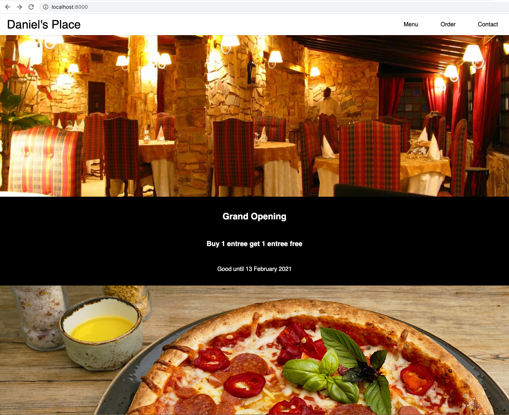

Next, let's make the three dishes appear in a grid below our special. We will use a [CSS grid](https://learncssgrid.com) for this:

```css
.dishes {
    display: grid;
    grid-template-columns: repeat(3, 1fr);
    grid-gap: 20px;
}

.dishes img {
    height: 100%;
    width: 100%;
    object-fit: cover;
}
```

Notice that we setup a grid of 3 columns and a gap between each column. We then set the image height and width to 100%, with `object-fit` to keep the images all the same size and cropped if necessary.

This looks pretty good:


Finally we will fix up the map, which is currently too big:

```css
.contact {
    margin-bottom: 20px;
}

.contact img {
    max-width: 500px;
    margin: auto;
}
```

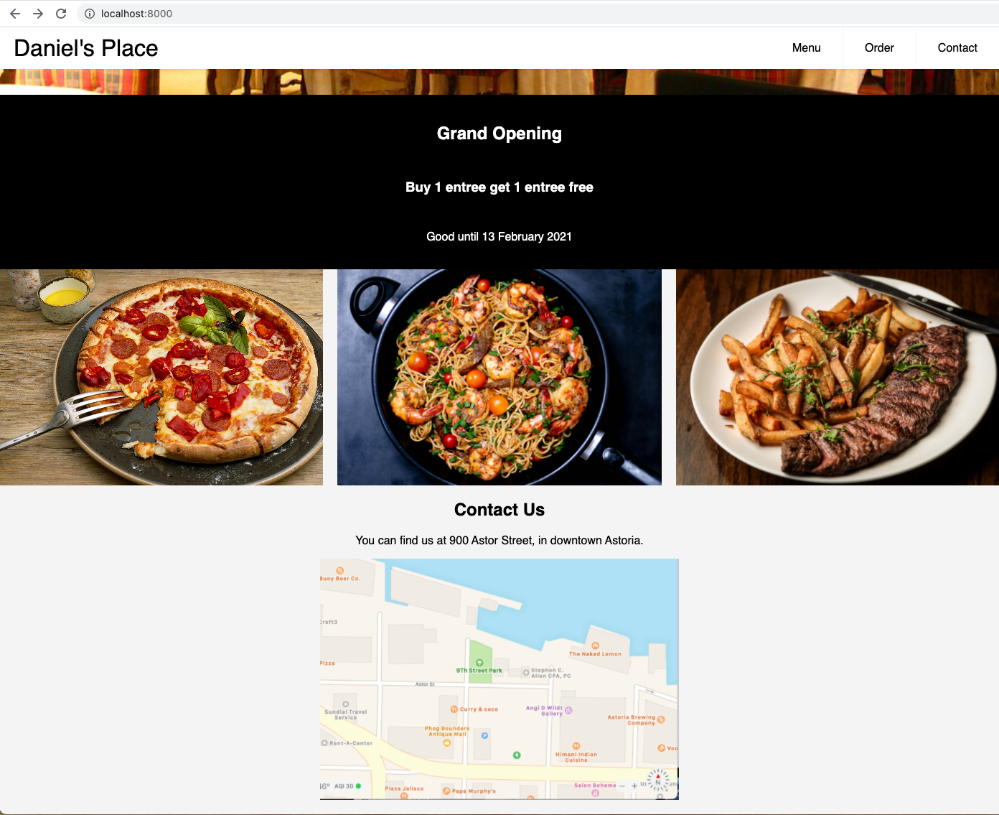

## Typography

Before we finish, it's a good idea to pay attention to typography. The styles we copied from the responsive menu set the font to Helvetic. Let's go to [Google Fonts](https://fonts.google.com) and look for a replacement sans-serif font. I chose [Josefin Sans](https://fonts.google.com/specimen/Josefin+Sans?category=Sans+Serif&preview.text_type=custom&sidebar.open=true&selection.family=Josefin+Sans).

To use, this, modify the `head` of the HTML page by adding these links:

```html
    <link rel="preconnect" href="https://fonts.gstatic.com">
    <link href="https://fonts.googleapis.com/css2?family=Josefin+Sans&display=swap" rel="stylesheet">
```

You also need to select this font in the CSS styles for the page:

```css
body {
    font-family: 'Josefin Sans', sans-serif;
}
```

You can see the improvement:

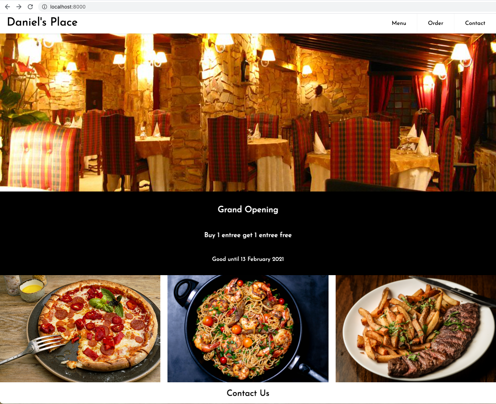

Normally we would also take a look at relative font sizes (`h1` vs `h2` vs `p`) and ensure paragraphs aren't too wide for readability.

## Explaining the CSS for the responsive menu

Let's come back to the CSS for the menu. Feel free to skip this unless you really want to see some of the gory details.

The entire header uses a fixed position and a `z-index` to keep it on top when you scroll the page:

```css
.header {
    background-color: #fff;
    box-shadow: 1px 1px 4px 0 rgba(0, 0, 0, .1);
    position: fixed;
    width: 100%;
    z-index: 3;
}
```

A common way to render a menu is to mark it as an unordered list, `ul`, and then remove the bullets and make it display either horizontally or vertically (depending on the type of menu or the responsive design). You can see that with the `list-style` set to none and all margin and padding removed:

```css
.header ul {
    margin: 0;
    padding: 0;
    list-style: none;
    overflow: hidden;
    background-color: #fff;
}
```

Remember that we're using mobile-first design, so the styles below apply all the time, but especially for mobile (the only breakpoints are for larger screens):

```css
.header li a {
    display: block;
    padding: 20px 20px;
    border-right: 1px solid #f4f4f4;
    text-decoration: none;
}

.header li a:hover,
.header .menu-btn:hover {
    background-color: #f4f4f4;
}
```

This styles the menu with padding between each link and no underlines for the links. It also puts a faint background on the menu items when you hover on them.

The logo is floated to the left and any link decorations are moved:

```css
.header .logo {
    display: block;
    float: left;
    font-size: 2em;
    padding: 10px 20px;
    text-decoration: none;
}
```

Here we have a [CSS transition](https://www.w3schools.com/css/css3_transitions.asp) so that the menu animates, over 0.2 seconds, to be zero height when it is closed:

```css
.header .menu {
    clear: both;
    max-height: 0;
    transition: max-height .2s ease-out;
}
```

Finally, we get to the rather complex stuff to animate the menu so it alternates between the familiar hamburger symbol and an X when it is opened. Remarkably, we can do this with pure CSS. As a reminder, here is the HTML:

```html
    <input class="menu-btn" type="checkbox" id="menu-btn" />
    <label class="menu-icon" for="menu-btn"><span class="navicon"></span></label>
```

The checkbox is used to hold the state of whether the menu has been clicked or not. This lets us toggle the icon between open and closed statse. The actual menu icon is a label around an empty span.

First, the menu icon is floated to the right with some padding:

```css
.header .menu-icon {
    cursor: pointer;
    display: inline-block;
    float: right;
    padding: 28px 20px;
    position: relative;
    user-select: none;
}
```

Next, the span, called `navicon`, has a background that is a shade of dark gray/black, with a height of 2px. This renders the middle bar of the hamburger.

If you have not seen this kind of notation before, this means apply the styles to any `.menu-icon` class inside of a `.header` class.

```css
.header .menu-icon .navicon {
    background: #333;
    display: block;
    height: 2px;
    position: relative;
    transition: background .2s ease-out;
    width: 18px;
}
```

Notice this also uses a transition so that the background color changes when its value changed, which is when the menu is toggled to the `open` state. This will be used to remove the middle bar of the hamburger icon so it can transition to the `X` instead. The `ease-out` simply means that the transition is fast and then slows down at the end.

Now we are going to use [CSS `before` and `after` pseudo-elements](https://css-tricks.com/almanac/selectors/a/after-and-before/). These allow you to insert content even though it is not listed in the HTML.
In this case, we are going to add a top line for the hamburger menu using the `before` pseudo-element and a bottom line using the `after` pseudo-element:

```css
.header .menu-icon .navicon:before,
.header .menu-icon .navicon:after {
    background: #333;
    content: '';
    display: block;
    height: 100%;
    position: absolute;
    transition: all .2s ease-out;
    width: 100%;
}
```

Notice we have transitions on these as well, so that all properties are transitioned to new values when they change.

We need to specify how far above the center the top line of the hamburger icon is adjusted. Likewise for the bottom line of the hamburger icon:

```css
.header .menu-icon .navicon:before {
    top: 5px;
}

.header .menu-icon .navicon:after {
    top: -5px;
}
```

Now for the checkbox! We first hide it:

```css
.header .menu-btn {
    display: none;
}
```

Even though it is hidden, you still click it when you click the menu icon.

We change the maximum height of the menu when this checkbox is checked:

```css
.header .menu-btn:checked~.menu {
    max-height: 240px;
}
```

The `~` symbol here means there can be any number of elements in between the `menu-btn` and the `menu` -- the menu is not a child but is below the checkbox.

We likewise make the background of the icon transparent when it is activated. This removes that middle bar on the hamburger icon:

```css
.header .menu-btn:checked~.menu-icon .navicon {
    background: transparent;
}
```

Finally, when the checkbox is clicked to activate the menu we also *rotate* the top and bottom bars of the hamburger icon to transform them into an `X`:

```css
.header .menu-btn:checked~.menu-icon .navicon:before {
    transform: rotate(-45deg);
}

.header .menu-btn:checked~.menu-icon .navicon:after {
    transform: rotate(45deg);
}
```

Pretty amazing we can do that!

## Image Credits 

<a href="https://search.creativecommons.org/photos/14329a78-ac89-4f0f-9a2b-0062ae95d464">"Restaurant Le Malesan"</a> by nedoho is licensed under CC BY-SA 2.0

<span>Photo of pizza by <a href="https://unsplash.com/@wesual?utm_source=unsplash&amp;utm_medium=referral&amp;utm_content=creditCopyText">Wesual Click</a> on <a href="https://unsplash.com/s/photos/pizza?utm_source=unsplash&amp;utm_medium=referral&amp;utm_content=creditCopyText">Unsplash</a></span>

<span>Photo of pasta by <a href="https://unsplash.com/@islandsandsunsets?utm_source=unsplash&amp;utm_medium=referral&amp;utm_content=creditCopyText">Olayinka Babalola</a> on <a href="https://unsplash.com/s/photos/pasta?utm_source=unsplash&amp;utm_medium=referral&amp;utm_content=creditCopyText">Unsplash</a></span>

<span>Photo of steak by <a href="https://unsplash.com/@covertnine?utm_source=unsplash&amp;utm_medium=referral&amp;utm_content=creditCopyText">Tim Toomey</a> on <a href="https://unsplash.com/s/photos/steak?utm_source=unsplash&amp;utm_medium=referral&amp;utm_content=creditCopyText">Unsplash</a></span>